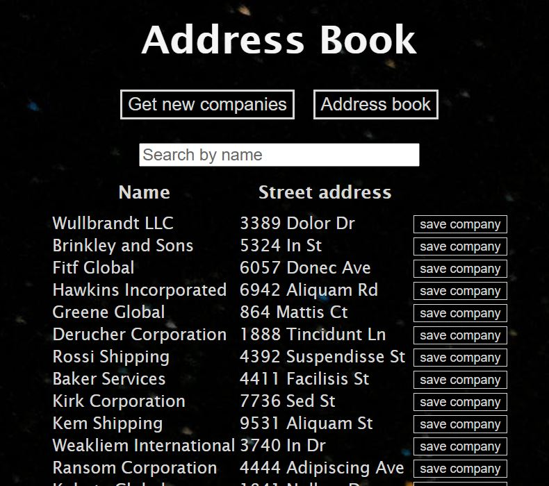
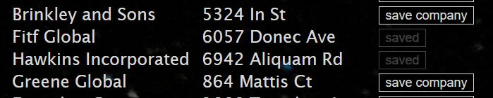
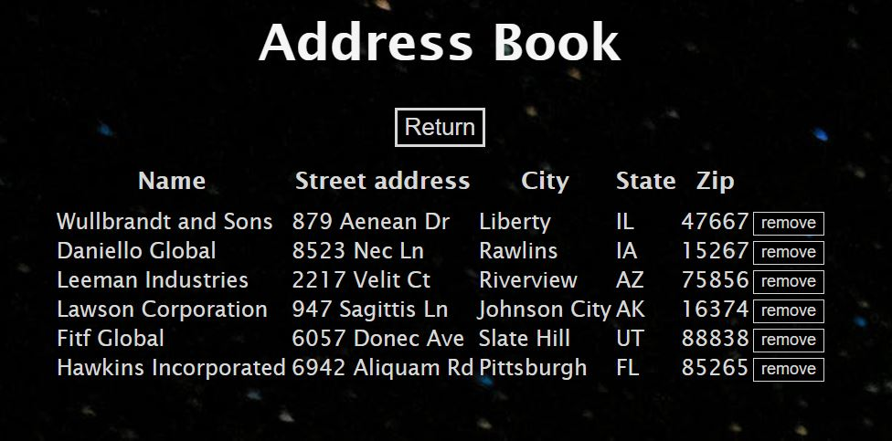

# Description

A full stack address book demo app

## Features

- List data
- Filter listed data by name
- Save data to database
- List saved from database

## Data source

http://www.filltext.com/?rows=100&pretty=true&id={index}&name={business}&address={addressObject}

## Tech

- Spring Boot, JPA, H2, JDK8
- AngularJS

## Requirements (used)

- Node (12.16.3), npm (6.14.4)
- Spring Boot (2.2.10), JDK8 (1.8.0_261)
- Angular CLI (10.0.6)

## Installation

```console
foo@bar:projectroot/$ mvn clean install
foo@bar:projectroot/angular-frontend-example$ npm install
```

## Screenshots

Main view  
  
Items saved  
  
Saved items view  

